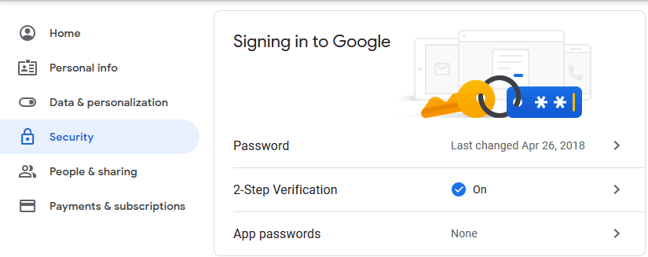

# PokéFarm 
## A React + Java full-stack application built using Pokemon!

## Quick Overview:
A web app where the user can create an account, select a starter pokemon, then send that
Pokemon to work. The Pokemon will earn money the that can be used to buy more Pokemon, but be careful! 
If the working Pokemon is fired, the player will not get paid. The challenge is to recall the Pokemon before getting fired in a way to optimize earnings.

## Screenshots:
Coming soon...

## Tech Used: 
### **Frontend**
- **React:**
    - React Testing Library: https://testing-library.com/
    - React Router: https://reactrouter.com/en/main
- **Material UI:** https://mui.com/
- **Axios:** https://axios-http.com/
- **Sass:** https://sass-lang.com/
- **Jest:** https://jestjs.io/
- **Prettier:** https://prettier.io/
### **Backend**
- **Java**
    - Spring: https://spring.io/ 
    - JavaMail API + Spring JavaMailSender: [Docs](https://docs.spring.io/spring-framework/docs/current/javadoc-api/org/springframework/mail/javamail/JavaMailSender.html)
    - Guava
    - Jackson
    - Lombok: https://projectlombok.org/
    - Log4j2
    - Serialization
    - CheckStyle: https://checkstyle.org/
    - JUnit5
    - Mockito

- **MySQL**

<br/>

## In-Depth Development Overview
**Frontend:** Built using React using MaterialUI for its aesthetic components. Styling is handled using Sass in order to take advantage of variables, functions etc. Gives a cleaner stylesheet. React router is used to rout the apps to correct pages, as well as protecting routes from URL manipulation. State management is done using context provider and hooks. Axios is used in preference to Fetch API, due to its simplicity. Testing for JS is done with Jest and for React components with React Testing Library.

**Backend:** Built using Java + Spring Boot to build rest endpoints, and Spring Java Mail Sender is used to send confirmation emails to new users. Jackson was used to convert JSON to Java objects. Logging for debugging purposes is handled by Log4J2, files are created and logs appended. Testing is done back Junit5 with Mockito to mock out dependencies. Checkstyle is added for style consistency.

## Setup: 
Instructions for running this web app locally.
- **VS code:** https://code.visualstudio.com/
- **Spring Tool Suite for Eclipse:** https://spring.io/tools
    - Comes with out of box embedded Tomcat for local web development 

1. Clone repo: ```git clone https://github.com/zevyirmiyahu/pokefarm.git```
2. Setup App email config
    - Generate Gmail app password "Acount Settings" ⮕ "Security" ⮕ "App-Passwords"
    
    - In ```pokefarm/pokefarm-server/src/main/resources``` change email to your email and password given in above step.
    - In ```pokefarm/pokefarm-server/src/main/java/com/pokefarm/app/constants/EmailConstants.java``` Change the ```SENDER``` constant to equal your email.
3. Config checkstyle in Eclipse:
    - In Eclipse go to "Help" ⮕ "Eclipse MarketPlace..." Then search for CheckStyle Plugin and install.
    - Update pom.xml to match plugin checkstyle version (currently this project is using Checkstyle 10.4)
4. Configure lombok, which is a utility annotations library, but needs to be configured in an IDE, so
some of the annotations and utility methods can be recognized. 
    - 1. Open pokefarm-server in Sping Tool Suite
    - 2. Unde Maven Dependencies, find **lombok.jar** and right click it and select "Run As" ⮕ "Java Application"
    - 3. Specifiy the location of Spring Tools Suite and click install in the prompt
    - 4. Close Spring Tool Suite and reopen, refresh project & rebuild.
    - 5. Check to See if Lombok is installed in About Spring Tools Suite Dialog
        - 📚 Further Reference: [Lombok Spring Tool Suite Installation](https://stackoverflow.com/questions/52780535/lombok-with-spring-tool-suite-4)
5. Setup MySQL by following: https://www.prisma.io/dataguide/mysql/setting-up-a-local-mysql-database 
6. Start the MySQl server locally.
    - Personally, I recommend adding the following **alias** to the ```.bash_profile```
    <br/>
        ```alias mysql.start="sudo /usr/local/mysql/support-files/mysql.server start"```
        <br/>
        ```alias mysql.stop="sudo /usr/local/mysql/support-files/mysql.server stop"```
        <br/>
        ```alias mysql.restart="sudo /usr/local/mysql/support-files/mysql.server restart"```
        <br/>
        ```alias mysql.status="sudo /usr/local/mysql/support-files/mysql.server status"```
        <br/>
        ```alias mysql.login="mysql -u root -p"```
7. In the terminal of mysql> server, run the following: 
    ```
    CREATE DATABASE pokefarm;
    ```
    ```
    USE pokefarm;
    ```
    ```
    CREATE TABLE users (
        id INT AUTO_INCREMENT PRIMARY KEY,
        user_id VARCHAR(255),
        user_name VARCHAR(255),
        password VARCHAR(255),
        email VARCHAR(255),
        money INT CHECK (money >= 0),
        pokemons JSON
    );
    ```
    Next we need to create a user that our application is already configured up to use.
    ```
    CREATE USER 'developer'@'localhost' IDENTIFIED BY 'StupidPassword';
    ```
    And we need to grant the the appropriate priveleges for our pokefarm database.
    ```
    GRANT ALL PRIVILEGES ON pokefarm.* TO 'developer'@'localhost';
    ```
    Now, reload the changed privileges into memory with:
    ```
    FLUSH PRIVILEGES;
    ```

8. Start frontend code ⮕ open pokefarm-client in VS code and in the terminal run: ```npm start```
9. Start backend code ⮕ using Spring Tool Suite, open pokefarm-server and click the run button.
10. Open a browser and go to: ```http://localhost:3000/``` **Play & Enjoy!** 

<br/>

## Author: 
I'm a software developer + ☕ coffee addict, learn more about me ⮕
**Personal Site:** [Zev Yirmiyahu](https://zevyirmiyahu.com/)

## Credit:
The grassy field background image was created by [WillDinoMaster55](https://www.deviantart.com/willdinomaster55/art/Grass-with-River-Background-907641083)


<!--   -->